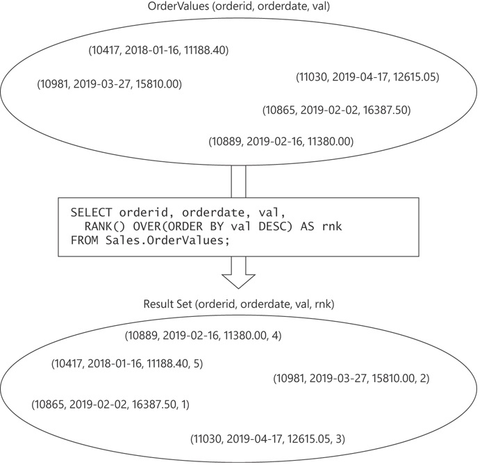
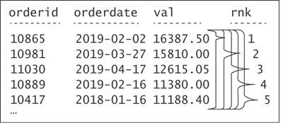
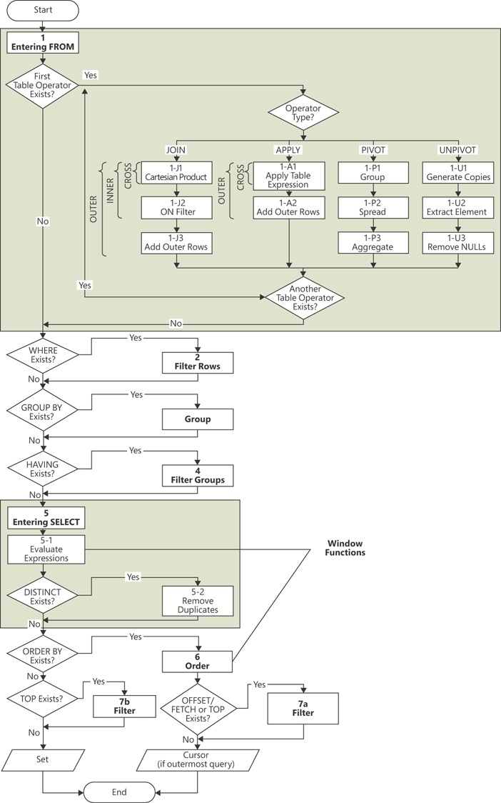

# Window Functions

A window function is a function applied to a set of rows. A
window is the term the SQL standard uses to describe the
context for the function to operate in. SQL uses a clause called
OVER in which you provide the window specification. 

OVER clause defines a window for the function with respect to
the current row. And this is true for all rows in the result set of
the query. In other words, with respect to each row, the OVER
clause defines a window independent of the window defined
for other rows.

The first time the SQL standard introduced support for
window functions was in an extension document to SQL:1999
that covered what they called “OLAP functions” back then.
We're on SQL:2023 right now. 

SQL is based (or
attempts to be based) on the relational model. The relational
model is a mathematical model for data management and
manipulation formulated and proposed initially by E. F. Codd
in the late 1960s. The relational model is based on two
mathematical foundations: set-theory and predicate logic. SQL is an attempt to create a language based on the
relational model. 

If you need to write SQL queries and you want to
understand the language you’re dealing with, you need to
think in set-based terms.

Window ordering has nothing
to do-at least conceptually-with the query’s presentation
ordering. Figure 1 tries to illustrate the idea that both the
input to a query with a window function and the output are
relational, even though the window function has ordering as
part of its specification. What this means is that the order of the
rows does not matter.




```sql
SELECT orderid, orderdate, val,
RANK() OVER(ORDER BY val DESC) AS rnk
FROM Sales.OrderValues;
```

```
orderid orderdate val rnk
-------- ---------- --------- ----
10865 2019-02-02 16387.50 1
10981 2019-03-27 15810.00 2
11030 2019-04-17 12615.05 3
10889 2019-02-16 11380.00 4
10417 2018-01-16 11188.40 5
```

This is how the language thinks of window functions. 
The function logically defines - for each
row in the result set of the query - a separate, independent
window. Absent any restrictions in the window specification,
each window consists of the set of all rows from the result set
of the query as the starting point. However, you can add
elements to the window specification (for example,
partitioning, framing, and so on) that will further restrict the
set of rows in each window.




With respect to each window function and row in the result
set of the query, the OVER clause conceptually creates a
separate window. In our query, we have not restricted the
window specification in any way; we just defined the ordering
specification for the calculation. So, in our case, all windows
are made of all rows in the result set. They all coexist at the same time. In each, the rank is calculated as one more than the
number of rows that have a greater value in the val attribute
than the current value. 

The optional window partitioning element is implemented
with a PARTITION BY clause and is supported by all window
functions. It restricts the window of the current calculation to
only those rows from the result set of the query that have the
same values in the partitioning columns as in the current row. If a PARTITION BY clause is not specified, the window is
not restricted.

Window framing is essentially another filter that further
restricts the rows in the window partition. It is applicable to
aggregate window functions as well as to three of the offset
functions (FIRST_VALUE, LAST_VALUE, and NTH_VALUE). 
The framing specification in the standard includes a ROWS,
GROUPS or RANGE option that defines the starting row and
ending row of the frame, as well as a window frame-exclusion
option. The window frame-exclusion
option specifies what to do with the current row and its peers
in case of ties.

```sql 
SELECT empid, ordermonth, qty,
SUM(qty) OVER(PARTITION BY empid
ORDER BY ordermonth
ROWS BETWEEN UNBOUNDED PRECEDING
AND CURRENT ROW) AS runqty
FROM Sales.EmpOrders;
```

```
empid ordermonth qty runqty
------ ---------- ---- -------
1 2017-07-01 121 121
1 2017-08-01 247 368
1 2017-09-01 255 623
1 2017-10-01 143 766
1 2017-11-01 318 1084
...
```

Window functions aren’t supported in all query clauses; rather,
they’re supported only in the SELECT and ORDER BY
clauses.


### Logical query processing flow in SQL Server.


The following list shows the order:

1. FROM
2. WHERE
3. GROUP BY
4. HAVING
5. SELECT
    1. Evaluate Expressions (window functions allowed here)
    2. Remove Duplicates
6. ORDER BY (window functions allowed here)
7. OFFSET-FETCH / TOP

Only the query clauses SELECT and ORDER BY support window functions directly. The reason for the limitation is to avoid ambiguity by operating on (almost) the final result set of the query as the starting point for the windowed calculation.

There is a workaround that allows you to use window functions indirectly in query elements that don’t support those directly. The workaround is a table expression in the form of a CTE or derived table.

---

#### WINDOW AGGREGATE FUNCTIONS

Window aggregate functions are the same functions as
grouped aggregate functions (for example, COUNT, MIN,
MAX, SUM,and so on); only instead of applying them to
groups in grouped queries, you apply them to windows
defined by the OVER clause.

```
function_name(<arguments>) OVER(
[ <window partition clause> ]
[ <window order clause> [ <window frame clause> ] ] )
```

The purpose of all three elements is to filter the rows in the window. When you don’t apply any restrictions to the window —namely, when you use empty parentheses in the OVER clause—the window consists of all rows in the result set of the underlying query. 

The window frame clause can include three parts and takes the following form:
```
<window frame units> <window frame extent> [ <window frame exclusion> ]
```
In the window frame units part, you indicate ROWS, GROUPS, or RANGE.


| Clause   | Offset refers to      | Meaning                       | Example
| -------- | --------------------- | ----------------------------- |
| `ROWS`   | number of rows        | move N rows                   | ROWS BETWEEN 1 PRECEDING AND CURRENT ROW. previous row + current row
| `RANGE`  | value distance        | move N value units            | ORDER BY RANGE BETWEEN 1000 PRECEDING AND CURRENT ROW. So if current salary = 5000, then only rows inside 4000–5000 range are considered. Offset must be numeric/date compatible (so that it can compare values)
| `GROUPS` | number of peer groups | move N duplicate-value groups | ORDER BY col1 GROUPS BETWEEN 1 PRECEDING AND CURRENT ROW means include previous group + current group 


The window frame extent part is where you indicate the offsets of the bounds with respect to the current row.

Finally, the window frame exclusion part allows you to specify whether to exclude the current row, its peers, or both.

Example with ROWS clause:
```
ROWS BETWEEN UNBOUNDED PRECEDING |
 <n> PRECEDING |
<n> FOLLOWING |
CURRENT ROW
AND
UNBOUNDED FOLLOWING |
<n> PRECEDING |
<n> FOLLOWING |
CURRENT ROW
```

For the low bound of the frame, UNBOUNDED PRECEDING means there is no low boundary point; <n> preceding and <n> following
specifies a number of rows before and after the current one, respectively; and CURRENT ROW, obviously, means that the starting row is the current row. As for the high bound of the frame, you can see the options are quite similar, except that if you don’t want a high boundary point, you indicate UNBOUNDED FOLLOWING, naturally.

```sql
SELECT 
empid, ordermonth,
MAX(qty) OVER(PARTITION BY empid
ORDER BY ordermonth
ROWS BETWEEN 1 PRECEDING
AND 1 PRECEDING) AS prvqty,
qty AS curqty,
MAX(qty) OVER(PARTITION BY empid
ORDER BY ordermonth
ROWS BETWEEN 1 FOLLOWING
AND 1 FOLLOWING) AS nxtqty,
AVG(qty) OVER(PARTITION BY empid
ORDER BY ordermonth
ROWS BETWEEN 1 PRECEDING
AND 1 FOLLOWING) AS avgqty
FROM Sales.EmpOrders;
```
```
empid ordermonth prvqty curqty nxtqty avgqty
------ ----------- ------- ------- ------- -------
1 2017-07-01 NULL 121 247 184
1 2017-08-01 121 247 255 207
1 2017-09-01 247 255 143 215
1 2017-10-01 255 143 318 238
1 2017-11-01 143 318 536 332
...
1 2019-01-01 583 397 566 515
1 2019-02-01 397 566 467 476
1 2019-03-01 566 467 586 539
1 2019-04-01 467 586 299 450
1 2019-05-01 586 299 NULL 442
...
```


The GROUPS option is similar to ROWS, only instead of specifying how many rows to go backward or forward with respect to the current row, you specify how many distinct window ordering groups (based on the sort key) to go backward or forward with respect to the window ordering group containing the current row.

As an example, you need to query the Sales.OrderValues view and return for
each order the percent that the current order value represents
out of the total of all orders placed in the last three days of
activity.

```sql 
SELECT orderid, orderdate, val,
CAST( 100.00 * val /
SUM(val) OVER(ORDER BY orderdate
GROUPS BETWEEN 2 PRECEDING
AND CURRENT ROW)
AS NUMERIC(5, 2) ) AS pctoflast3days
FROM Sales.OrderValues;
```

```
orderid orderdate val pctoflast3days
-------- ---------- -------- ---------------
10248 2017-07-04 440.00 100.00
10249 2017-07-05 1863.40 80.90
10250 2017-07-08 1552.60 34.43
10251 2017-07-08 654.06 14.50
10252 2017-07-09 3597.90 46.92
10253 2017-07-10 1444.80 19.93
10254 2017-07-11 556.62 9.94
10255 2017-07-12 2490.50 55.44
10256 2017-07-15 517.80 14.52
10257 2017-07-16 1119.90 27.13
```

To do the exact thing without using GROUPS clause:

```sql 
WITH C AS
(
SELECT orderdate,
SUM(SUM(val))
OVER(ORDER BY orderdate
ROWS BETWEEN 2 PRECEDING
AND CURRENT ROW) AS sumval
FROM Sales.OrderValues
GROUP BY orderdate
)
SELECT O.orderid, O.orderdate,
CAST( 100.00 * O.val / C.sumval AS NUMERIC(5, 2) ) AS
pctoflast3days
FROM Sales.OrderValues AS O
INNER JOIN C
ON O.orderdate = C.orderdate;
```


The SQL standard also supports specifying the RANGE option
as the window frame unit. Here are the possibilities for the low
and high bounds—or endpoints—of the frame:

```
RANGE BETWEEN UNBOUNDED PRECEDING |
<val> PRECEDING |
<val> FOLLOWING |
CURRENT ROW
AND
UNBOUNDED FOLLOWING |
<val> PRECEDING |
<val> FOLLOWING |
CURRENT ROW
```

This option is supposed to enable you to specify the low and high bounds of the frame more dynamically—as a logical difference between the current row’s ordering value and the bound’s value. Think about the difference between saying “Give me the total quantities for the last three points of activity,” versus saying “Give me the total quantities for the period starting two months before the current period and until the current period.” The former concept is what ROWS was designed to provide, and the latter concept is what RANGE was designed to provide. 

```sql 
SELECT empid, ordermonth, qty,
SUM(qty) OVER(PARTITION BY empid
ORDER BY ordermonth
RANGE BETWEEN INTERVAL '2' MONTH PRECEDING
AND CURRENT ROW) AS sum3month
FROM Sales.EmpOrders;
```

Window functions in the SQL standard support an option called window frame exclusion that is part of the framing specification. This option controls whether to include the current row and its peers in case of ties in the ordering element’s values.

The standard supports four window frame exclusion
possibilities, listed here with a short description:
```
■ EXCLUDE CURRENT ROW Exclude the current row.
■ EXCLUDE GROUP Exclude the current row as well as its peers.
■ EXCLUDE TIES Keep the current row but exclude its peers.
■ EXCLUDE NO OTHERS (default) Don’t exclude further rows.
```

```sql 
-- EXCLUDE CURRENT ROW (exclude current row)
SELECT keycol, col1,
COUNT(*) OVER(ORDER BY col1
RANGE BETWEEN UNBOUNDED PRECEDING
AND CURRENT ROW
EXCLUDE CURRENT ROW) AS cnt
FROM dbo.T1;
```
```
keycol col1 cnt
----------- ---------- -----------
2   A  1
3   A  1
5   B  4
7   B  4
11  B  4
13  C  8
17  C  8
19  C  8
23  C  8
```


```sql 
-- EXCLUDE GROUP (exclude current row and its peers)
SELECT keycol, col1,
COUNT(*) OVER(ORDER BY col1
RANGE BETWEEN UNBOUNDED PRECEDING
AND CURRENT ROW
EXCLUDE GROUP) AS cnt
FROM dbo.T1;
```

```
keycol col1 cnt
----------- ---------- -----------
2   A   0
3   A   0
5   B   2
7   B   2
11  B   2
13  C   5
17  C   5
```
```sql 
-- EXCLUDE TIES (keep current row, exclude peers)
SELECT keycol, col1,
COUNT(*) OVER(ORDER BY col1
RANGE BETWEEN UNBOUNDED PRECEDING
AND CURRENT ROW
EXCLUDE TIES) AS cnt
FROM dbo.T1;
```

```
keycol col1 cnt
----------- ---------- -----------
2   A 1
3   A 1
5   B 3
7   B 3
11  B 3
13  C 6
17  C 6
19  C 6
23  C 6
```


#### Nesting Group Functions within Window Functions
```sql 
SELECT empid,
SUM(val) AS emptotal,
SUM(val) / SUM(SUM(val)) OVER() * 100. AS pct
FROM Sales.OrderValues
GROUP BY empid;

-- this is the same as 

WITH C AS
(
	SELECT empid,
	SUM(val) AS emptotal
	FROM Sales.OrderValues
	GROUP BY empid
)
SELECT empid, emptotal,
emptotal / SUM(emptotal) OVER() * 100. AS pct
FROM C;
```

```
empid emptotal pct
------ ---------- -----------
3 202812.88 16.022500
6 73913.15 5.839200
9 77308.08 6.107400
7 124568.24 9.841100
1 192107.65 15.176800
4 232890.87 18.398800
2 166537.76 13.156700
5 68792.30 5.434700
8 126862.29 10.022300
```

Another example: 
Query the Sales.Orders table, and return for each employee the distinct order dates along with the count of distinct customers handled by the current employee  up to, and including, the current date.

```sql 
WITH C AS
(
SELECT empid, orderdate,
CASE
WHEN ROW_NUMBER() OVER(PARTITION BY empid, custid
ORDER BY orderdate) = 1
THEN custid
END AS distinct_custid
FROM Sales.Orders
)
SELECT empid, orderdate,
SUM(COUNT(distinct_custid)) OVER(PARTITION BY empid
ORDER BY orderdate) AS
numcusts
FROM C
GROUP BY empid, orderdate;
```

```
empid orderdate numcusts
----------- ----------- -----------
1 2017-07-17 1
1 2017-08-01 2
1 2017-08-07 3
1 2017-08-20 4
1 2017-08-28 5
1 2017-08-29 6
1 2017-09-12 6
1 2017-09-16 7
1 2017-09-20 8
```

#### Ranking Functions 
The standard supports four window functions that deal with ranking calculations. Those are ROW_NUMBER, NTILE, RANK, and DENSE_RANK. The standard covers the first two as one category and the last two as another, probably due to determinism-related differences.

The NTILE function allows you to arrange the rows within the window partition in roughly equally sized tiles, based on the input number of tiles and specified window ordering.

```sql 
SELECT orderid, val,
ROW_NUMBER() OVER(ORDER BY val) AS rownum,
NTILE(10) OVER(ORDER BY val) AS tile
FROM Sales.OrderValues;
```
```
orderid val rownum tile
-------- --------- ------- -----
10782 12.50 1 1
10807 18.40 2 1
10586 23.80 3 1
10767 28.00 4 1
10898 30.00 5 1
...
```

With paging, the page size is a constant and the number of pages is dynamic—it’s aresult of the count of rows in the query result set divided by the page size. With tiling, the number of tiles is a constant, and the tile size is dynamic—it’s a result of the count of rows divided by the requested number of tiles.

```sql 
SELECT orderid, orderdate, val,
ROW_NUMBER() OVER(ORDER BY orderdate DESC) AS rownum,
RANK() OVER(ORDER BY orderdate DESC) AS rnk,
DENSE_RANK() OVER(ORDER BY orderdate DESC) AS drnk
FROM Sales.OrderValues;

-- this is the same as this (rank and denserank)

SELECT orderid, orderdate, val,
(SELECT COUNT(*)
FROM Sales.OrderValues AS O2
WHERE O2.orderdate > O1.orderdate) + 1 AS rnk,
(SELECT COUNT(DISTINCT orderdate)
FROM Sales.OrderValues AS O2
WHERE O2.orderdate > O1.orderdate) + 1 AS drnk
FROM Sales.OrderValues AS O1;
```

```
orderid orderdate val rownum rnk drnk
-------- ----------- -------- ------- ---- ----
11077 2019-05-06 232.09   1 1 1
11076 2019-05-06 498.10   2 1 1
11075 2019-05-06 792.75   3 1 1
11074 2019-05-06 1255.72  4 1 1
11073 2019-05-05 1629.98  5 5 2
11072 2019-05-05 484.50   6 5 2
11071 2019-05-05 5218.00  7 5 2
11070 2019-05-05 300.00   8 5 2
11069 2019-05-04 86.85    9 9 3
11068 2019-05-04 2027.08 10 9 3
```

#### Rank Distribution Functions

According to the SQL standard, distribution functions compute the relative rank of a row in the window partition, expressed as a ratio between 0 and 1—what most of us think of as a percentage. The two variants—PERCENT_RANK and CUME_DIST—perform the computation slightly differently.

```
■ Let rk be the RANK of the row using the same window specification as the
distribution function’s window specification.
■ Let nr be the count of rows in the window partition.
■ Let np be the number of rows that precede or are peers of the current one (the
same as the minimum rk that is greater than the current rk minus 1, or nr if
the current rk is the maximum).
```

Then PERCENT_RANK is calculated as follows: (rk – 1) / (nr – 1). And CUME_DIST is calculated as follows: np / nr.The query in Listing 2-12 computes both the percentile rank and cumulative distribution of student test scores, partitioned by testid and ordered by score.

```sql 
SELECT testid, studentid, score,
PERCENT_RANK() OVER(PARTITION BY testid ORDER BY score) AS
percentrank,
CUME_DIST() OVER(PARTITION BY testid ORDER BY score) AS
cumedist
FROM Stats.Scores;

-- equivalent code 

WITH C AS
(
SELECT testid, studentid, score,
RANK() OVER(PARTITION BY testid ORDER BY score) AS rk,
COUNT(*) OVER(PARTITION BY testid) AS nr
FROM Stats.Scores
)
SELECT testid, studentid, score,
1.0 * (rk - 1) / (nr - 1) AS percentrank,
1.0 * (SELECT COALESCE(MIN(C2.rk) - 1, C1.nr)
FROM C AS C2
WHERE C2.testid = C1.testid
AND C2.rk > C1.rk) / nr AS cumedist
FROM C AS C1;

```

```
testid studentid score percentrank cumedist
---------- ---------- ----- ------------ ---------
Test ABC Student E 50 0.000 0.111
Test ABC Student C 55 0.125 0.333
Test ABC Student D 55 0.125 0.333
Test ABC Student H 65 0.375 0.444
Test ABC Student I 75 0.500 0.556
Test ABC Student F 80 0.625 0.778
Test ABC Student B 80 0.625 0.778
Test ABC Student A 95 0.875 1.000
Test ABC Student G 95 0.875 1.000
```

#### OFFSET FUNCTIONS

Window offset functions include two categories of functions. One category contains functions whose offset is relative to the current row, including the LAG and LEAD functions. Another category contains functions whose offset is relative to the start or end of the window frame, including the functions FIRST_VALUE, LAST_VALUE, and NTH_VALUE.

```sql
SELECT custid, orderdate, orderid, val,
FIRST_VALUE(val) OVER(PARTITION BY custid
ORDER BY orderdate, orderid
ROWS BETWEEN UNBOUNDED PRECEDING
AND CURRENT ROW) AS
val_firstorder,
LAST_VALUE(val) OVER(PARTITION BY custid
ORDER BY orderdate, orderid
ROWS BETWEEN CURRENT ROW
AND UNBOUNDED FOLLOWING) AS
val_lastorder
FROM Sales.OrderValues
ORDER BY custid, orderdate, orderid;
```

```
custid orderdate orderid val val_firstorder
val_lastorder
------- ----------- -------- -------- --------------- --------
------
1 2018-08-25 10643 814.50 814.50 933.50
1 2018-10-03 10692 878.00 814.50 933.50
1 2018-10-13 10702 330.00 814.50 933.50
1 2019-01-15 10835 845.80 814.50 933.50
1 2019-03-16 10952 471.20 814.50 933.50
1 2019-04-09 11011 933.50 814.50 933.50
2 2017-09-18 10308 88.80  88.80  514.40
2 2018-08-08 10625 479.75 88.80  514.40
2 2018-11-28 10759 320.00 88.80  514.40
2 2019-03-04 10926 514.40 88.80  514.40
```

