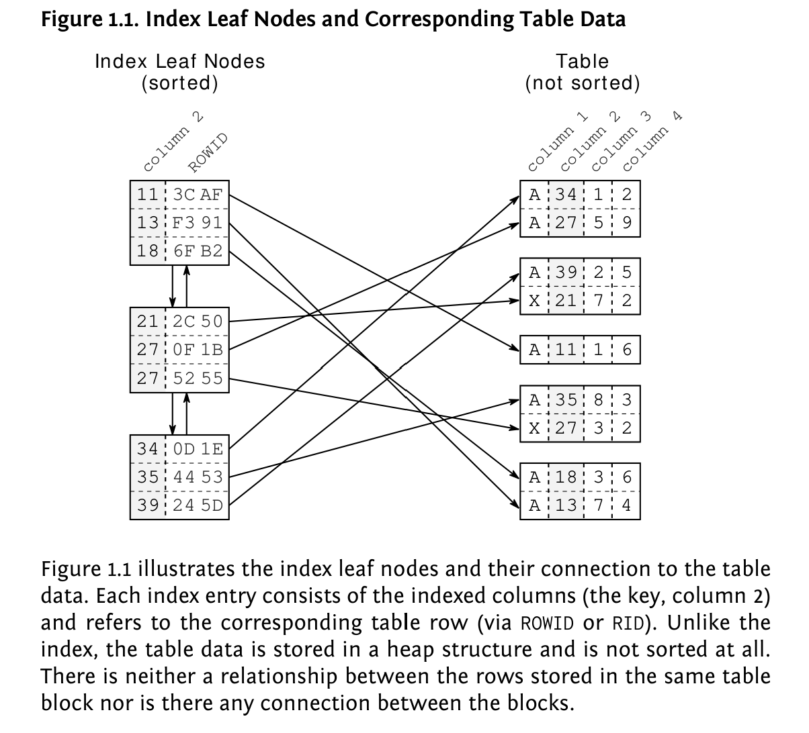
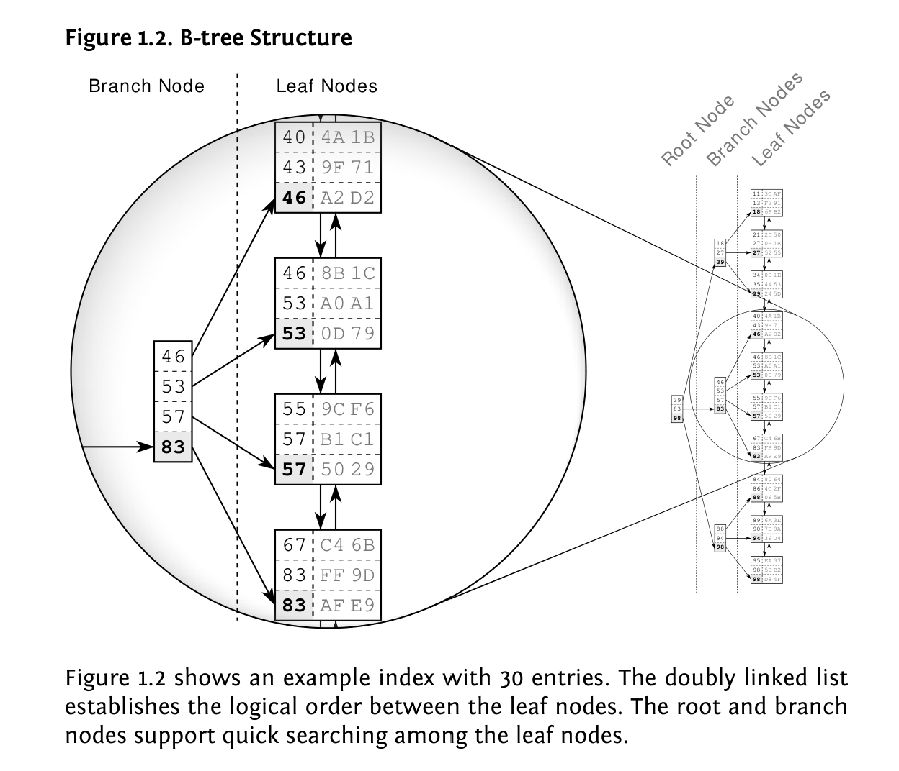
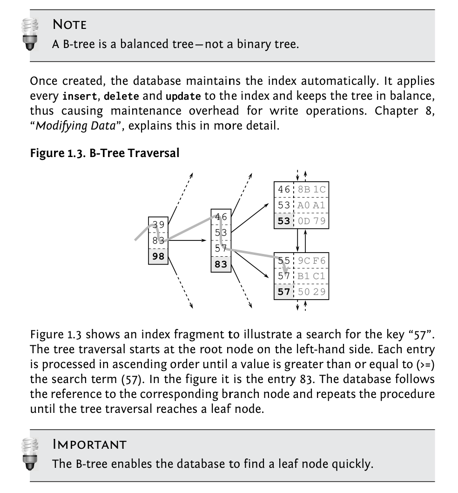

## Database Indexes

An index is a distinct structure in the database that is built using the create index statement. It requires its own disk space and holds a copy of the indexed table data. That means that an index is pure redundancy.
Creating an index does not change the table data; it just creates a new data structure that refers to the table. A database index is, after all, very much like the index at the end of a book: it occupies its own space, it is highly redundant, and it refers to the actual information stored in a different place.

The database combines two data structures to meet the challenge: a doubly linked list and a search tree. These two structures explain most of the database’s performance characteristics.

Databases use doubly linked lists to connect the so-called index leaf nodes.
Each leaf node is stored in a database block or page; that is, the database’s smallest storage unit. All index blocks are of the same size—typically a few kilobytes. The database uses the space in each block to the extent possible and stores as many index entries as possible in each block. That means that the index order is maintained on two different levels: the index entries within each leaf node, and the leaf nodes among each other using a doubly linked list.

There are still cases where an index lookup doesn’t work as fast as expected. 

The first ingredient for a slow index lookup is the leaf node chain. Consider the search for “57” in Figure above again. There are obviously two matching entries in the index. At least two entries are the same, to be more precise: the next leaf node could have further entries for “57”. The database must read the next leaf node to see if there are any more matching entries. That means that an index lookup not only needs to perform the tree traversal, it also needs to follow the leaf node chain.

The second ingredient for a slow index lookup is accessing the table. Even a single leaf node might contain many hits—often hundreds. The corresponding table data is usually scattered across many table blocks (see Figure 1.1, “Index Leaf Nodes and Corresponding Table Data”). That means that there is an additional table access for each hit.

An index lookup requires three steps: (1) the tree traversal; (2) following the
leaf node chain; (3) fetching the table data. The tree traversal is the only
step that has an upper bound for the number of accessed blocks—the index
depth. The other two steps might need to access many blocks—they cause
a slow index lookup.

The INDEX UNIQUE SCAN performs the tree traversal only. The Oracle
database uses this operation if a unique constraint ensures that the
search criteria will match no more than one entry.

The INDEX RANGE SCAN performs the tree traversal and follows the leaf
node chain to find all matching entries. This is the fallback operation
if multiple entries could possibly match the search criteria.

The TABLE ACCESS BY INDEX ROWID operation retrieves the row from
the table. This operation is (often) performed for every matched record
from a preceding index scan operation.

The important point is that an INDEX RANGE SCAN can potentially read a large
part of an index. If there is one more table access for each row, the query
can become slow even when using an index.

