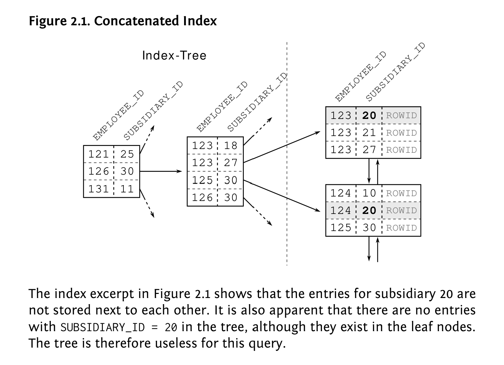

# What's inside an Index?

### Example: B+ Tree Index on `employee_id`

Assume this index exists:

```sql
CREATE INDEX idx_employee_id ON employees(employee_id);
```

And the table has these keys:

```
5, 8, 12, 15, 19, 22, 27, 31, 36, 40, 44, 48
```

Assume each node can store **3 keys max**.

---
```
# B+ Tree Structure

                               [22 | 36]
                                (ROOT)
                    ┌────────────┼────────────┐
                    │            │            │

               [12 | 19]     [27 | 31]     [40 | 44]
              (INTERNAL)    (INTERNAL)    (INTERNAL)

             ┌────┼────┐    ┌────┼────┐    ┌────┼────┐
             │    │    │    │    │    │    │    │    │

          [5,8] [12,15] [19]  [22] [27] [31]  [36] [40] [44,48]
           │      │      │     │    │    │     │    │     │
           └──────┴──────┴─────┴────┴────┴─────┴────┴─────┘
                (all leaves linked left → right)
    [5,8] → [12,15] → [19] → [22] → [27] → [31] → [36] → [40] → [44,48]

```
Important B+ tree properties visible here:

**Root node**
```
[22 | 36]
```

Tells the search which branch to take.

---

**Internal nodes**

Example:

```
[12 | 19]
```

They **only contain keys** and pointers to lower nodes.

They **do not contain row pointers**.

---

**Leaf nodes**

```
[5 → row]
[8 → row]
```

These contain:

```
(index_key → row_pointer)
```

Example:

```
31 → (page 18, slot 4)
```

---

**Leaf nodes are linked**

```
[5] ↔ [8] ↔ [12] ↔ [15] ↔ [19] ↔ ...
```

This is why **range queries are extremely fast**.

---

### Example lookup

Query:

```sql
SELECT * FROM employees
WHERE employee_id = 31;
```

Traversal:

### Step 1 — root

```
[22 | 36]
```

31 is:

```
22 < 31 < 36
```

Go to **middle child**.

---

### Step 2 — internal node

```
[27 | 31]
```

31 is ≥ 31

Go to **third child**.

---

### Step 3 — leaf

```
[27 → row]
[31 → row]
```

Found:

```
31 → (row pointer)
```

Database fetches the row.

---

#### Now let’s show a B-tree (not B+)

```
Keys: 5, 8, 12, 15, 19, 22, 27, 31, 36, 40, 44, 48 (max 3 keys per node)
```

### B-Tree

```
                               [22]
                              (ROOT)
                         /              \
                        /                \
                       /                  \

                [8 | 15]                [31 | 40]
               (INTERNAL)              (INTERNAL)

            /      |      \          /      |       \
           /       |       \        /       |        \

        [5]     [12]     [19]    [27]     [36]     [44 | 48]
       (LEAF)  (LEAF)   (LEAF)  (LEAF)   (LEAF)      (LEAF)
```

### Important B-tree properties visible here

### 1. Keys exist at multiple levels

Example:

```
[22]
```

This **is an actual stored key** that points to a row.

So if you search for `22`, the search **stops at the root**.

---

### 2. Keys are not duplicated

Notice `22`, `31`, `40` **do not appear again in leaves**.

In a **B+ tree they would appear again**, but **B-trees store each key exactly once**.

---

### 3. Internal node meaning

Node:

```
[8 | 15]
```

Defines three ranges:

```
< 8
8–14
≥ 15
```

Which map to:

```
[5]     [12]     [19]
```

---

### 4. Leaves are not linked

Unlike B+ trees, these leaves are **not sequentially linked**.

So range scans require more navigation.

---

#### Example lookup

Query:

```
employee_id = 36
```

Traversal:

```
ROOT
[22]
  ↓

RIGHT CHILD
[31 | 40]
  ↓

MIDDLE CHILD
[36]
```

Found.

### Why databases prefer B+ trees

Because internal nodes **don’t store row pointers**, they can store **many more keys**.

Example page sizes:

```
disk page = 16 KB
```

Approx capacity:

| Tree    | Keys per node |
| ------- | ------------- |
| B-tree  | ~200          |
| B+ tree | ~400          |

That means:

```
1 billion rows
≈ 3–4 levels
```

So a lookup might only require **3 disk reads**.

---
This is what leaves store in different DBs

| Database             | Storage model | Leaf contains     |
| -------------------- | ------------- | ----------------- |
| PostgreSQL           | heap          | key → row pointer |
| Oracle               | heap          | key → ROWID       |
| MySQL InnoDB PK      | clustered     | key → full row    |
| MySQL secondary      | clustered     | key → primary key |
| SQL Server clustered | clustered     | key → full row    |

## The simplified mental model

All major DB indexes behave like this:

```text
ROOT
 ↓
INTERNAL NODES (navigation keys)
 ↓
LEAF NODES (actual index entries)
```

Then:

### Heap storage

```text
leaf → row pointer → table row
```

### Clustered storage

```text
leaf → row
```

or

```text
leaf → primary key → row
```


In practice:

```text
Oracle ≈ B+ tree
MySQL InnoDB ≈ B+ tree
PostgreSQL ≈ B+ tree
SQL Server ≈ B+ tree
```

They just **use different naming conventions**.

---

# Reading Execution Plans

## Tables

```text
EMPLOYEES
---------
employee_id (PK)
department_id
salary

DEPARTMENTS
-----------
department_id (PK)
location_id

LOCATIONS
---------
location_id (PK)
country
```

Relationships:

```text
EMPLOYEES.department_id → DEPARTMENTS.department_id
DEPARTMENTS.location_id → LOCATIONS.location_id
```

---

# Key Execution Plan Terms

## INDEX UNIQUE SCAN

Searches an index using a **unique key**.

Example:

```sql
WHERE employee_id = 100
```

Since `employee_id` is a primary key, Oracle knows **only one row can match**.

So it performs:

```
INDEX UNIQUE SCAN EMPLOYEES_PK
```

Cost: very cheap (logarithmic lookup in the index tree).

Result:

```
ROWID → location of the row in the table
```

---

## INDEX RANGE SCAN

Searches an index where **multiple rows may match**.

Example:

```sql
WHERE department_id = 10
```

Many employees may belong to that department.

Oracle scans the range of index entries that match.

---

## TABLE ACCESS BY INDEX ROWID

Once Oracle finds a row in an index, it must fetch the **actual row from the table**.

Indexes contain:

```
index_key → ROWID
```

Example:

```
employee_id=100 → ROWID AAAB12
```

Oracle then reads the table block at that ROWID.

Operation:

```
TABLE ACCESS BY INDEX ROWID
```

---

## TABLE ACCESS FULL

Oracle scans the **entire table**.

Example:

```
TABLE ACCESS FULL LOCATIONS
```

This happens when:

* table is small
* no useful index exists
* scanning everything is cheaper

---

## NESTED LOOPS (Join Algorithm)

A **nested loop join** is a way to combine two tables.

Conceptually it works like this:

```
for each row in outer_table
    find matching rows in inner_table
```

Example:

```
NESTED LOOPS
   EMPLOYEES
   DEPARTMENTS
```

Execution logic:

```
for each employee
    find that employee's department
```

The first table is called the **driving table** (outer table).

---

## HASH JOIN (Join Algorithm)

A **hash join** is used when many rows must be joined.

Algorithm:

1. Read one table and build a **hash table in memory**
2. Scan the other table and probe the hash table

Conceptually:

```
build hash(department_id) from departments
scan employees
match using hash lookup
```

Hash joins are efficient when joining **large datasets**.

---


## MERGE JOIN

A **merge join** appears when both tables are **already sorted by the join key** (or cheap to sort).

Example query:

```sql
SELECT *
FROM employees e
JOIN departments d
ON e.department_id = d.department_id;
```

Assume:

```
EMPLOYEES = 1,000,000 rows
DEPARTMENTS = 500 rows
```

And both tables have indexes on:

```
department_id
```

Oracle might produce:

```
MERGE JOIN
   INDEX RANGE SCAN EMPLOYEES_DEPT_IDX
   INDEX RANGE SCAN DEPARTMENTS_PK
```

---

### How MERGE JOIN Works

Merge join behaves like the **merge step of merge sort**.

Algorithm:

```
tableA sorted by key
tableB sorted by key
```

Then:

```
while rows remain
    compare keys
    advance the smaller key
    output matches
```

Conceptually:

```
Employees (sorted by department_id)
1
2
2
3
4

Departments (sorted)
1
2
3
```

Merge process:

```
1 = 1 → match
2 = 2 → match
2 = 2 → match
3 = 3 → match
4 > 3 → advance departments
```

No random lookups are required.

---

## When Each Join Algorithm Is Used

### Nested Loop Join

Best when:

```
outer table small
inner table indexed
```

Example:

```
find employee
lookup department
```

Typical plan:

```
NESTED LOOPS
   EMPLOYEES
   DEPARTMENTS
```

---

### Hash Join

Best when:

```
large tables
no useful indexes
```

Example:

```
employees = 1M rows
departments = 10k rows
```

Plan:

```
HASH JOIN
   TABLE ACCESS EMPLOYEES
   TABLE ACCESS DEPARTMENTS
```

Algorithm:

```
build hash table
scan other table
```

---

### Merge Join

Best when:

```
both tables already sorted
```

Example plan:

```
MERGE JOIN
   INDEX RANGE SCAN EMPLOYEES_DEPT_IDX
   INDEX RANGE SCAN DEPARTMENTS_PK
```

Algorithm:

```
scan both sorted streams
merge them
```

## Rule of Thumb (Very Useful)

Optimizers typically choose joins like this:

```
very small rows → NESTED LOOP
medium/large join → HASH JOIN
sorted inputs → MERGE JOIN
```

Merge joins are more common in:

```
data warehouses
analytics queries
large scans
```

---


# Scenario 1 — Selective Lookup

Query:

```sql
SELECT e.employee_id, d.department_id, l.country
FROM employees e
JOIN departments d
  ON e.department_id = d.department_id
JOIN locations l
  ON d.location_id = l.location_id
WHERE e.employee_id = 100;
```

Key filter:

```
employee_id = 100
```

Expected result:

```
1 employee
```

---

# Execution Plan

```
Id | Operation                       | Name
-----------------------------------------------
 0 | SELECT STATEMENT
 1 |  HASH JOIN
 2 |   NESTED LOOPS
 3 |    TABLE ACCESS BY INDEX ROWID  | EMPLOYEES
 4 |     INDEX UNIQUE SCAN           | EMPLOYEES_PK
 5 |    TABLE ACCESS BY INDEX ROWID  | DEPARTMENTS
 6 |     INDEX UNIQUE SCAN           | DEPARTMENTS_PK
 7 |   TABLE ACCESS FULL             | LOCATIONS
```

---

# Plan Tree

```
SELECT
└─ HASH JOIN
   ├─ NESTED LOOPS
   │  ├─ EMPLOYEES
   │  │  └─ INDEX EMPLOYEES_PK
   │  └─ DEPARTMENTS
   │     └─ INDEX DEPARTMENTS_PK
   └─ LOCATIONS
```

---

# Actual Execution Order

Execution starts from the **deepest nodes**.

```
4 → 3 → 6 → 5 → 2 → 7 → 1 → 0
```

Step-by-step:

1. Search employee index (`employee_id = 100`)
2. Fetch employee row
3. Lookup department via department index
4. Fetch department row
5. Nested loop combines employee + department
6. Scan LOCATIONS table
7. Hash join matches location
8. Return result

---

# Driving Table (Scenario 1)

Look at the nested loops node:

```
NESTED LOOPS
   EMPLOYEES
   DEPARTMENTS
```

The **first child is the driving table**.

Driving table:

```
EMPLOYEES
```

Conceptual execution:

```
for each employee row
    lookup department
```

Since only **one employee** matches, this join is extremely efficient.

---

# Scenario 2 — Optimizer Flips Join Order

New query:

```sql
SELECT e.employee_id, d.department_id, l.country
FROM employees e
JOIN departments d
  ON e.department_id = d.department_id
JOIN locations l
  ON d.location_id = l.location_id
WHERE l.country = 'Germany';
```

Now the filter is on:

```
LOCATIONS.country
```

Assume:

```
LOCATIONS = 20 rows
EMPLOYEES = 1,000,000 rows
```

Oracle decides it is cheaper to **start with LOCATIONS**.

---

# Execution Plan (Flipped Join Order)

```
Id | Operation                      | Name
----------------------------------------------
 0 | SELECT STATEMENT
 1 |  NESTED LOOPS
 2 |   NESTED LOOPS
 3 |    TABLE ACCESS FULL           | LOCATIONS
 4 |    TABLE ACCESS BY INDEX ROWID | DEPARTMENTS
 5 |     INDEX RANGE SCAN           | DEPT_LOCATION_IDX
 6 |   TABLE ACCESS BY INDEX ROWID  | EMPLOYEES
 7 |    INDEX RANGE SCAN            | EMP_DEPT_IDX
```

---

# Plan Tree

```
SELECT
└─ NESTED LOOPS
   ├─ NESTED LOOPS
   │  ├─ LOCATIONS
   │  └─ DEPARTMENTS
   │     └─ INDEX DEPT_LOCATION_IDX
   └─ EMPLOYEES
      └─ INDEX EMP_DEPT_IDX
```

---

# Actual Execution Order

```
3 → 5 → 4 → 2 → 7 → 6 → 1 → 0
```

Steps:

1. Scan LOCATIONS
2. Filter rows where `country = 'Germany'`
3. Find departments in those locations
4. Nested loop produces department rows
5. Find employees in those departments
6. Fetch employee rows
7. Return results

---

# Driving Table (Scenario 2)

Look at the first nested loop:

```
NESTED LOOPS
   LOCATIONS
   DEPARTMENTS
```

Driving table:

```
LOCATIONS
```

Conceptual execution:

```
for each location in Germany
    find departments
        find employees
```

---

# Critical Insight

**SQL join order does NOT determine execution order.**

SQL:

```
EMPLOYEES → DEPARTMENTS → LOCATIONS
```

Execution might be:

```
LOCATIONS → DEPARTMENTS → EMPLOYEES
```

The optimizer chooses the cheapest plan.

---

# Quick Rules for Reading Oracle Plans

1. Plans are printed **top-down but executed bottom-up**.
2. Look at **join operators** (`NESTED LOOPS`, `HASH JOIN`).
3. In a nested loop:

```
NESTED LOOPS
   A
   B
```

Execution logic:

```
for each row in A
    lookup rows in B
```

So **A is the driving table**.

---

# Final Mental Model

Execution plans are **data pipelines**.

Data flows through operators:

```
INDEX SCAN
→ TABLE ACCESS
→ JOIN
→ RESULT
```

The optimizer chooses the starting point based on:

```
selectivity
available indexes
estimated row counts
```

Understanding that choice explains **almost every execution plan**.

---


## Concatenated Indexes (multi-column, composite or combined index)
Let’s assume there is a company merger. The employees of the other company are added to our EMPLOYEES table so it becomes ten times as large. There is only one problem: the EMPLOYEE_ID is not unique across both companies. We need to extend the primary key by an extra identifier—e.g., a subsidiary ID. Thus the new primary key has two columns: the EMPLOYEE_ID as before and the SUBSIDIARY_ID to reestablish uniqueness

The index for the new primary key is therefore defined in the following way:

```
CREATE UNIQUE INDEX employee_pk
ON employees (employee_id, subsidiary_id);
```

Whenever a query uses the complete primary key, the database can use an INDEX UNIQUE SCAN—no matter how many columns the index has.

A concatenated index is just a B-tree index like any other that keeps the indexed data in a sorted list. The database considers each column according to its position in the index definition to sort the index entries. The first column is the primary sort criterion and the second column determines the order only if two entries have the same value in the first column and so on.


```sql 
SELECT first_name, last_name
FROM employees
WHERE subsidiary_id = 20;
```

The execution plan will reveal that the database does not use the index. Instead
it will perform a FULL TABLE SCAN.




The most important consideration when defining a concatenated index is how to choose the column order so it can be used as often as possible.

