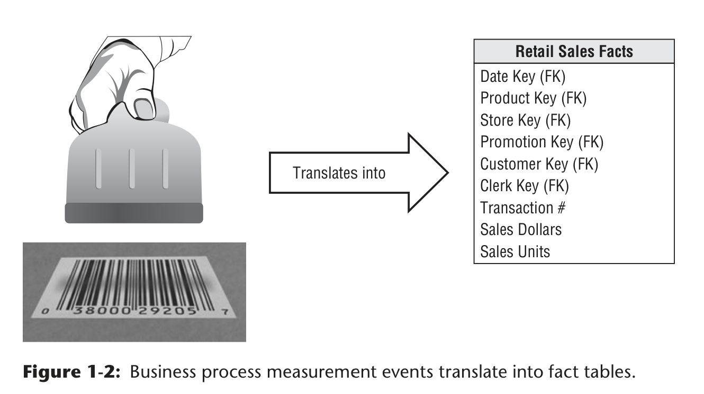
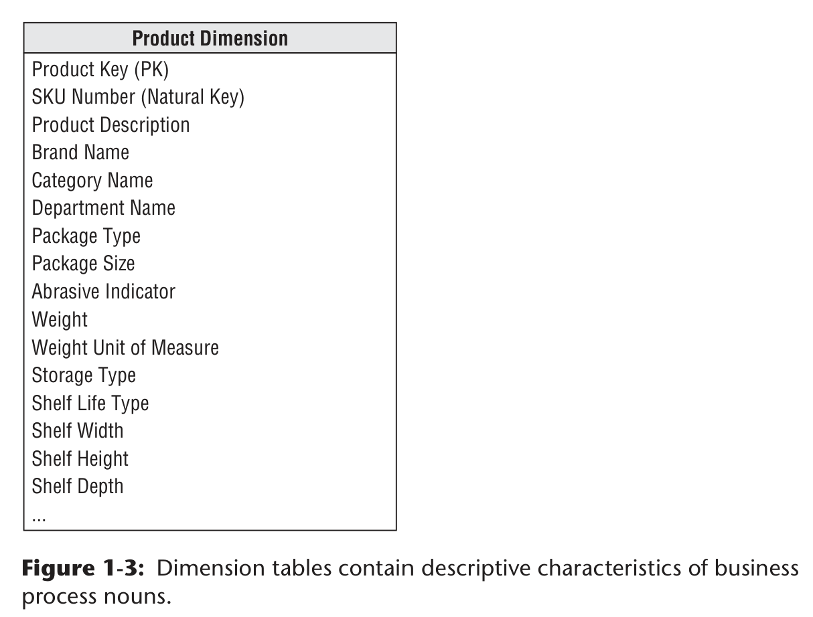
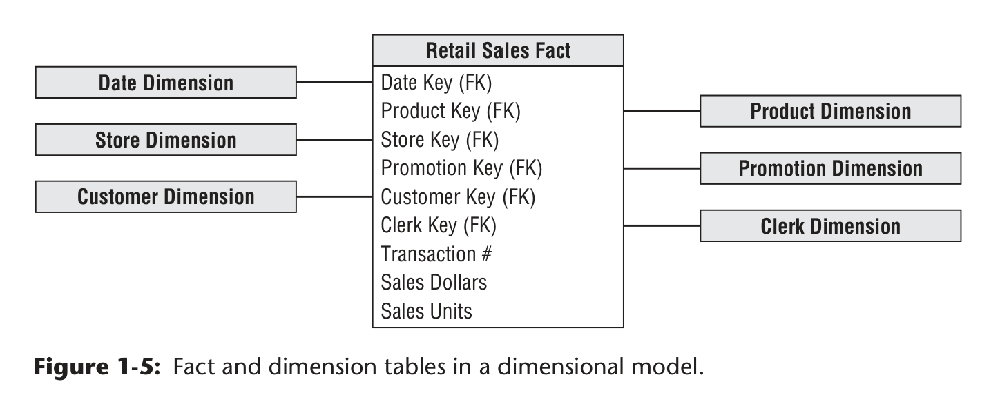

# Data Modelling

### Basic requirements of a Data Warehouse / Business Intelligence
1. The DW/BI system must make information easily accessible.
2. The DW/BI system must present information consistently.
3. The DW/BI system must adapt to change.
4. The DW/BI system must present information in a timely way.
5. The DW/BI system must be a secure bastion that protects the information assets.
6. The DW/BI system must serve as the authoritative and trustworthy foundation for improved decision making.
7. The business community must accept the DW/BI system to deem it successful.

---

Dimensional modeling is widely accepted as the preferred technique for presenting analytic data because it addresses two simultaneous requirements:
1. Deliver data that’s understandable to the business users.
2. Deliver fast query performance.

Although dimensional models are often instantiated in relational database management systems, they are quite diff erent from third normal form (3NF) models which seek to remove data redundancies.

The industry sometimes refers to 3NF models as entity-relationship (ER) models. Entity-relationship diagrams (ER diagrams or ERDs) are drawings that communicate the relationships between tables. Both 3NF and dimensional models can be represented in ERDs because both consist of joined relational tables; the key difference between 3NF and dimensional models is the degree of normalization. Because both model types can be presented as ERDs, we refrain from referring to 3NF models as ER models; instead, we call them normalized models to minimize confusion.

#### **A dimensional model contains the same information as a normalized model, but packages the data in a format that delivers user understandability, query performance, and resilience to change.**

Dimensional models implemented in relational database management systems are referred to as star schemas because of their resemblance to a star-like structure.

### Fact Tables for Measurements
* A **fact table** in dimensional modeling stores **quantitative measurements** (facts) from business events (e.g., sales transactions).

* Each row represents a **single event at a specific level of detail (grain)**, and all rows must have the **same grain** to avoid errors like double counting.

* Fact tables are **centralized** to ensure consistent data across the organization and avoid duplication.

* Facts are usually **numeric and additive** (e.g., sales amount), meaning they can be summed across many rows.

  * **Additive facts** → can be summed across all dimensions
  * **Semi-additive facts** → cannot be summed across some dimensions (e.g., time)
  * **Non-additive facts** → cannot be summed at all (e.g., unit price)

* Fact tables are:

  * **Large (many rows)** but **narrow (few columns)**
  * Often **sparse** (only store actual events, not zero-activity rows)
  * Typically make up the **majority of storage** in a data warehouse

* Text data should generally **not be stored in fact tables** (unless truly unique), but instead in **dimension tables** for better analysis and efficiency.

* Fact tables are linked to **dimension tables via foreign keys**, ensuring **referential integrity**.

* They often use a **composite primary key** made up of these foreign keys and represent **many-to-many relationships**.

* Fact tables fall into three types:

  1. **Transaction** (most common)
  2. **Periodic snapshot**
  3. **Accumulating snapshot**

👉 In short: A fact table is a large, structured table that records measurable business events at a consistent level of detail, optimized for aggregation and analysis.

### Dimension Tables for Descriptive Context

* **Dimension tables** provide the **descriptive context** for facts, answering the *who, what, where, when, how, and why* of business events.

* They:

  * Contain **textual attributes** (e.g., product name, brand, category)
  * Are usually **wide (many columns)** but **smaller (fewer rows)** than fact tables
  * Use a **single primary key** to link with fact tables (ensuring referential integrity)

* Dimension attributes are crucial because they:

  * Drive **filters, groupings, and report labels** (e.g., “sales by brand”)
  * Should be **clear, descriptive, and user-friendly** (avoid cryptic codes)
  * Enable better **analysis and usability** of the data warehouse

* Best practices:

  * Replace **codes with meaningful text**, but keep codes if they have business value
  * Extract embedded meanings from codes into **separate attributes**
  * Ensure **high data quality and completeness** for strong analytics

* **Fact vs dimension decision**:

  * **Facts** → numeric, continuously varying, used in calculations
  * **Dimensions** → descriptive, discrete values, used for filtering/grouping

* Dimension tables often include **hierarchies** (e.g., product → brand → category).

  * These are stored **denormalized (flattened)** in one table for simplicity and performance
  * Avoid **snowflaking (normalizing into multiple tables)** since it adds complexity with little benefit

👉 In short: Dimension tables store rich, descriptive attributes that make fact data understandable, searchable, and meaningful for analysis-and their quality largely determines the effectiveness of a data warehouse.

You’re right-that earlier summary flattened a lot of the nuance. Here’s a tighter version that preserves the *important subtleties*:

---

### Core Idea 

A **star schema** models a business process by linking a **central fact table (measurements)** to multiple **dimension tables (context at the time of the event)**. 

👉 Dimensions don’t just describe things-they describe the **state of the world *when the event happened***.

---

### Structural Insights

* The schema is intentionally **simple and symmetric**:

  * Every dimension connects directly to the fact table
  * All dimensions are **equally valid entry points** for analysis
  * There is **no bias toward specific query patterns**

* This symmetry is not just aesthetic-it ensures:

  * Users can ask **unexpected (ad hoc) questions**
  * The model doesn’t need redesign when analysis needs change

---

### Performance Nuance

* Query execution is optimized in a specific way:

  1. Filter **dimension tables first** (they’re small and indexed)
  2. Generate combinations of matching keys
  3. Use those to scan the **fact table in a single pass**

👉 This is why star schemas scale well even with very large fact tables.

---

### Atomic Data Principle (deeper meaning)

* Fact tables should store **atomic (lowest-level) data**, not aggregates
* Why?

  * Atomic data has **maximum dimensionality** (can be sliced many ways)
  * Aggregated data limits future analysis

👉 In other words:
**Detail = flexibility**
**Aggregation = constraint**

---

### Extensibility

The model is **gracefully extensible**, meaning:

* You can add:

  * New **dimensions** (if each fact row can map to one value)
  * New **facts** (if grain stays consistent)
  * New **attributes** in dimensions

* Crucially:

  * **No need to reload data**
  * **Existing reports don’t break or change results**

👉 This stability under change is a major design goal-not an accident.

---

### Big Picture Insight

The star schema works because it optimizes for:

* **Understandability (for humans)**
* **Performance (for systems)**
* **Adaptability (for change)**
