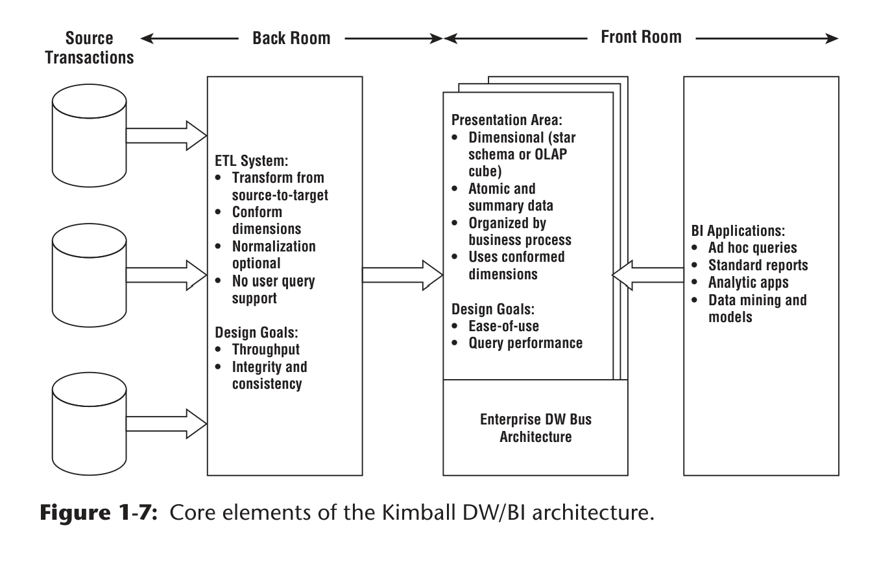

## 🧩 Core Components (4-Part Architecture)

Kimball divides a DW/BI system into **four distinct layers**, each with a clear role:

### 1. **Operational Source Systems**

* These are the **original transaction systems** (ERP, apps, etc.).
* Optimized for:

  * **Performance & availability**
  * **Simple, record-level queries**
* Key limitations:

  * Minimal historical data
  * Poor cross-system consistency (e.g., different definitions of customers/products)
* 👉 They are **outside the warehouse’s control** and not designed for analytics.

---

### 2. **ETL System (Back Room)**

Acts as the **data preparation engine** between sources and the warehouse.

#### Key Functions:

* **Extract**: Pull data from source systems
* **Transform**:

  * Clean (fix errors, missing values)
  * Integrate multiple sources
  * Standardize and conform dimensions
  * Deduplicate
* **Load**:

  * Populate dimensional models (facts & dimensions)

#### Important Nuances:

* Adds **significant value** by improving data quality and consistency.
* Often uses **sequential processing / flat files**, not necessarily relational DBs.
* May optionally use **normalized (3NF) structures**, but:

  * This can cause **double processing (ETL twice)** → more cost, time, storage.
  * Not the final goal.

#### Critical Principle:

* ❌ **No user access allowed**
* Focus on:

  * **Throughput**
  * **Integrity & consistency**

---

### 3. **Presentation Area (Front Room Data)**

This is the **heart of the data warehouse for users**.

#### Design Requirements:

* Must use **dimensional models**:

  * Star schemas or OLAP cubes
* Must contain:

  * **Atomic (detailed) data** → for unpredictable queries
  * Optional **aggregates** → for performance
* Organized by:

  * **Business processes**, not departments

#### Key Concepts:

* **Conformed dimensions**:

  * Shared dimensions (e.g., customer, product) across models
  * Enable integration across the enterprise
* **Bus architecture**:

  * Framework connecting all dimensional models
  * Prevents isolated “data silos”

#### Critical Principles:

* Data must be:

  * Easy to use
  * High-performing for queries
* ❌ Not acceptable:

  * Only summaries without detail
  * Department-specific inconsistent models

---

### 4. **Business Intelligence (BI) Applications**

Tools that **consume the presentation layer** for decision-making.

#### Types:

* Ad hoc query tools
* Reports & dashboards
* Analytical apps
* Data mining / predictive models

#### Key Insight:

* Most users prefer **prebuilt, parameter-driven tools**, not raw querying.
* Some advanced tools may **write results back** into systems.

---

## 🍽️ Restaurant Metaphor (Key Insight)

Kimball uses a powerful analogy:

### 🔙 ETL = Kitchen (Back Room)

* Transforms raw ingredients → finished meals (data)
* Focus on:

  * Efficiency (throughput)
  * Consistency (standard recipes)
  * Integrity (safe, clean food)
* ❌ Off-limits to customers

### 🔜 Presentation + BI = Dining Room (Front Room)

* Where users interact with data
* Success depends on:

  * **Quality (data accuracy)**
  * **Presentation (usability)**
  * **Service (performance, accessibility)**
  * **Cost**

---

## ⚖️ Key Architectural Philosophy

* Shift complexity to the **ETL (back room)**
  → simplifies BI usage in the **front room**
* Do transformations **once centrally**, not repeatedly by users
* Prioritize:

  * **Usability**
  * **Consistency**
  * **Integrated enterprise view**

---

## 🚨 Common Pitfalls Highlighted

* Over-investing in **normalized ETL databases** instead of usable presentation models
* Allowing **user access to ETL layer**
* Building **siloed dimensional models** (no conformed dimensions)
* Providing only **aggregated data** without detail

---

## 🧠 Bottom Line

A successful Kimball DW/BI system:

* Separates responsibilities clearly across layers
* Uses ETL to ensure **clean, consistent, integrated data**
* Delivers data via **dimensional models with full detail**
* Enables BI tools to provide **fast, intuitive insights**

---

# 🧠 Dimensional Modeling Myths — Deep Explanation

## ❌ Myth 1: Dimensional Models are Only for Summary Data

### 🔍 Why this myth exists

Historically:

* Early BI systems were built for **predefined reports**
* So teams stored **aggregated data only** (e.g., monthly sales totals)

People incorrectly associated:

> Dimensional model = reporting layer = summaries

---

### ✅ Kimball’s actual stance

Dimensional models must store:

* **Atomic (lowest-level) data**
* Plus **optional aggregates for performance**

---

### ⚠️ Critical Insight: *Unpredictability of BI*

You **cannot predict future business questions**.

Example:

* Today: “Total sales by region”
* Tomorrow: “Sales of product X by new customers in last 3 months”

👉 If you only stored summaries:

* You **lose the ability to answer new questions**
* You hit **“analytic brick walls”**

---

### 💣 Design Consequence

If you design with summaries:

* You are **hardcoding assumptions about the future**
* This is fundamentally **anti-BI**

---

### 🧬 Why atomic data is powerful

Atomic data is:

* **Composable** → can be aggregated in any way
* **Future-proof** → supports unknown queries
* **Flexible** → supports new dimensions later

---

### 🔁 Subtle Point About History

Another misconception:

> “Dimensional models can’t handle large history”

Reality:

* There is **no structural limitation**
* History retention depends only on:

  * Storage
  * Business needs

---

### 🧠 Deep takeaway

> Aggregates answer known questions.
> Atomic data enables unknown questions.

---

## ❌ Myth 2: Dimensional Models are Departmental

---

### 🔍 Why this myth exists

Because:

* Many real-world implementations **were built department-by-department**
* So people confuse:

  * **Implementation style** with
  * **Modeling philosophy**

---

### ✅ Kimball’s principle

Dimensional models must be built around:

> **Business processes**, not departments

Examples:

* Sales process
* Order fulfillment
* Customer service interactions

---

### ⚠️ Why this matters deeply

A **business process**:

* Is **shared across departments**

Example:

* Sales data used by:

  * Marketing
  * Finance
  * Logistics

---

### 💣 What goes wrong with departmental design

If each department builds its own model:

* Same metric → **different definitions**
* Leads to:

  * Conflicts
  * Reconciliation efforts
  * Loss of trust

---

### 🔗 Role of Conformed Dimensions

They ensure:

* Same “Customer”, “Product”, etc. across all models

👉 This is what enables:

* **Enterprise consistency**

---

### 🧠 Deep takeaway

> Departments consume data.
> Business processes produce data.

Design must follow **production**, not consumption.

---

## ❌ Myth 3: Dimensional Models are Not Scalable

---

### 🔍 Why this myth exists

Because:

* Dimensional models look “denormalized”
* People assume:

  * “Denormalized = inefficient”

---

### ✅ Reality

Dimensional models are:

* **Highly optimized for query performance**
* Supported by:

  * Modern DB engines
  * Columnar storage
  * Indexing strategies

---

### ⚠️ Key Subtlety: Logical vs Physical

Kimball emphasizes:

* **Logical equivalence**:

  * 3NF and dimensional models contain the **same information**

---

### 🧠 Important Distinction

| Aspect           | 3NF                  | Dimensional  |
| ---------------- | -------------------- | ------------ |
| Structure        | Normalized           | Denormalized |
| Query complexity | High                 | Low          |
| Performance      | Slower for analytics | Faster       |

👉 Same data, different usability

---

### 💣 Critical Insight

Dimensional models:

* Trade **storage redundancy**
* For **query simplicity and speed**

Which is exactly what BI needs.

---

### 🧠 Deep takeaway

> Scalability is not about normalization.
> It’s about how efficiently users can query massive data.

---

## ❌ Myth 4: Dimensional Models are Only for Predictable Usage

---

### 🔍 Why this myth exists

Because:

* Teams often design based on:

  * Reports
  * Dashboards

---

### ❌ The mistake

Designing for:

> “Top 10 reports”

---

### 💣 Why this fails

Reports:

* Change constantly
* Reflect **current thinking**, not future needs

---

### ✅ Correct approach

Design based on:

> **Measurement processes**

Example:

* Instead of: “Monthly sales report”
* Think: “Sales transaction event”

---

### ⚠️ Deep Concept: Stability vs Volatility

| Element            | Stability       |
| ------------------ | --------------- |
| Business processes | Stable          |
| Reports/queries    | Highly volatile |

👉 Design for stability

---

### 🔄 Flexibility Mechanism

Dimensional models are flexible because:

* Fact tables = atomic events
* Dimensions = rich descriptive context

---

### 💣 Consequence of wrong design

If you pre-summarize:

* You:

  * Lose drill-down capability
  * Can’t add new dimensions easily

---

### 🧠 Deep takeaway

> Designing for reports is designing for the past.
> Designing for processes is designing for the future.

---

## ❌ Myth 5: Dimensional Models Can’t Be Integrated

---

### 🔍 Why this myth exists

Because:

* Integration is **hard**
* Many implementations fail → blame the model

---

### ✅ Reality

Integration depends on:

> **Conformed dimensions + ETL discipline**

---

### 🔗 What “integration” really means

Not just:

* Linking tables

But:

* Same:

  * Definitions
  * Codes
  * Labels
  * Business rules

---

### ⚠️ Critical Insight

Normalization ≠ Integration

You can have:

* Perfectly normalized data
* That is still:

  * Inconsistent
  * Conflicting

---

### 🧠 Kimball’s inversion

Instead of:

> Normalize first, integrate later

Kimball says:

> Integrate first (via conformed dimensions)

---

### 💣 Failure mode

Without conformed dimensions:

* You get:

  * Isolated marts
  * Inconsistent metrics

---

### 🧠 Deep takeaway

> Integration is a governance + ETL problem, not a modeling format problem.

---

# 🔁 “Think Dimensionally” — Beyond Schema Design

This is **very important and often overlooked**.

Dimensional thinking affects:

---

## 1️ Requirements

Don’t ask:

* “What reports do you need?”

Ask:

* “What business processes generate these metrics?”

---

## 2️ Project Scope

* One project = **one business process**
* Prevents:

  * Over-scoping
  * Complexity explosion

---

## 3️ Prioritization

* Use:

  * Business value
  * Feasibility

👉 This aligns IT with business strategy

---

## 4️ Bus Matrix (Strategic Tool)

* Maps:

  * Processes ↔ Dimensions

Acts as:

* Blueprint
* Integration plan
* Agile roadmap

---

## 5️ Data Governance

Focus on:

* Core dimensions (business nouns)

Example:

* Customer
* Product
* Date

👉 These define:

* How the business “speaks about data”

---

# ⚡ Agile — Deeper Insight

---

## ✅ Why Kimball fits Agile

Because:

* It’s:

  * Incremental
  * Process-driven
  * Business-focused

---

## ❌ Where Agile goes wrong

When teams:

* Skip architecture
* Skip conformed dimensions

Result:

* Data silos (again!)

---

## 💣 Critical Insight

Conformed dimensions:

* Are not a delay
* They are a **force multiplier**

👉 Once built:

* Future development becomes faster

---

## 🧠 Deep takeaway

> Without architectural discipline, agile becomes chaos.

---

# 🏁 Final Synthesis

Dimensional modeling is often misunderstood because people focus on:

* Structure (tables, schemas)

Instead of:

* **Philosophy**

---

## 💡 Core Philosophy

1. Store **atomic data**
2. Model **business processes**
3. Use **conformed dimensions**
4. Design for **unknown future queries**
5. Shift complexity to **ETL, not users**

---

## 🧠 One powerful mental model

> Dimensional modeling is not about simplifying data.
> It’s about simplifying **access to complexity**.

---
